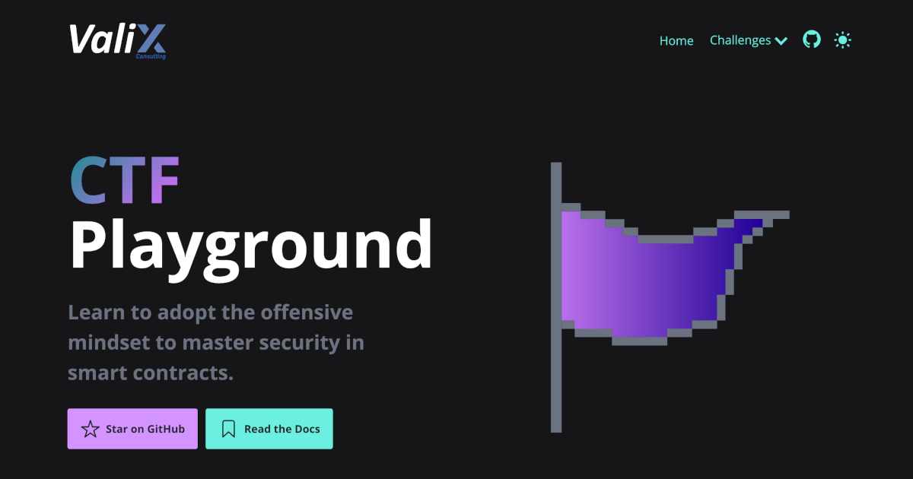

# Valix CTF Playground

An interactive Ethereum-based platform for mastering offensive security in Smart Contracts.

🚀 [CTF is now Live!](https://valixconsulting.github.io/ctf/){:target="_blank"}

## Getting started

Clone this repo and run any of the following commands in your terminal:

| Command           | Action                                       |
| :---------------- | :------------------------------------------- |
| `npm install`     | Installs dependencies                        |
| `npm run dev`     | Starts local dev server at `localhost:4321`  |
| `npm run build`   | Build your production site to `./dist/`      |
| `npm run preview` | Preview your build locally, before deploying |

## Thank you!
A big thank you to the creators of the awesome Astro static site generator :)
[accessible-astro-starter](https://github.com/markteekman/accessible-astro-starter)
